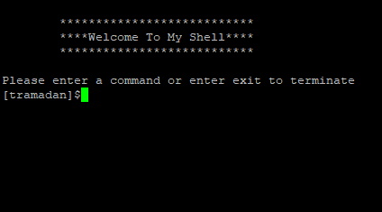
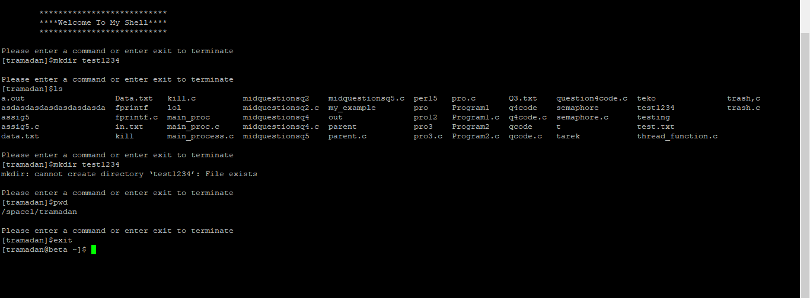
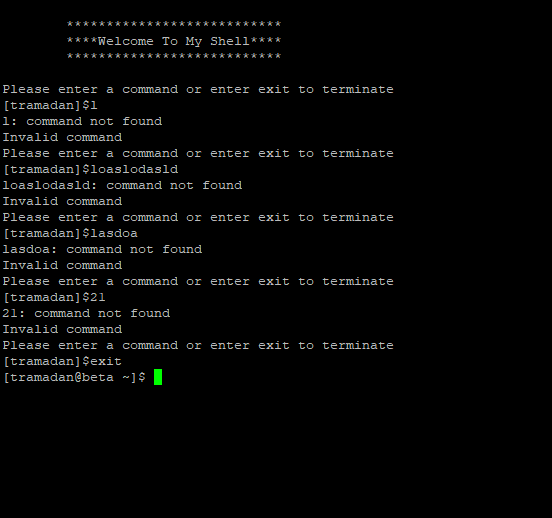
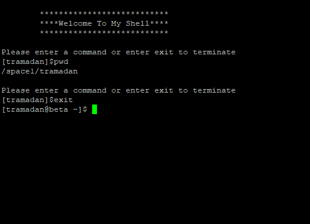

# unixshell
For this class project, we designed and implemented a simple, interacitve shell program that prompts the user for a command, parses the command, and then executes it with a
child process. The skeleton for the algorithm to solve the probelm was taken from the book used in the course operational requirements: C language, in the solution
we are required to use execv() instead of exevp(), which means we will have to read the PATH enviornment variable, then search each directory in the PATH for the command line
file name that appears on the command line.

#### Welcome message

#### Invoking commands

#### Invoking invalid commands

#### Exiting

